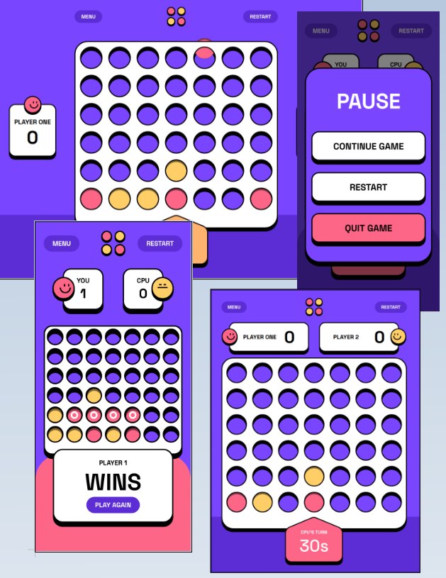

# Frontend Mentor - Connect Four game

## Table of contents

- [Overview](#overview)
  - [Expected behavior](#expected-behavior)
  - [Screenshot](#screenshot)
  - [Links](#links)
- [Built with](#built-with)

## Overview

Your challenge is to build out a Connect Four game and get it looking as close to Figma design as possible.

Your users should be able to:

- View the game rules
- Play a game of Connect Four against another human player (alternating turns on the same computer)
- View the optimal layout for the interface depending on their device's screen size
- See hover and focus states for all interactive elements on the page
- See the discs animate into their position when a move is made
- Play against the computer

### Expected behavior

- The initial screen should be the Main Menu.
- Player 1 goes first in the first game. The first turn then alternates in subsequent games.
- When a player wins a round, the win state is shown, and the winning player's score is incremented by 1.
- Each player has 30 seconds to take their turn. The counter counts down in real time. If it reaches zero, the win state is shown for the other player and their score is incremented by 1.
- Clicking the Menu button on the game board opens up the Ingame Menu.
- Clicking Quit Game from the Ingame Menu navigates to the Main Menu.
- Clicking the Restart button on the game board resets both players' scores to zero.

### Screenshot

Solution screenshot

### Links

- Live Site URL: [frontend-mentor-connect-four.vercel.app](https://frontend-mentor-connect-four.vercel.app/)

## Built with

- [React](https://reactjs.org/)
- [TypeScript](https://www.typescriptlang.org/)
- [React Router](https://reactrouter.com/en/main)
- [useContext](https://react.dev/reference/react/useContext)
- [SCSS](https://sass-lang.com/)
- [React Testing Library](https://testing-library.com/docs/react-testing-library/intro/)
